# CueMap Rust Engine

**High-performance temporal-associative memory store** that mimics the brain's recall mechanism.

## Overview

CueMap implements a **Continuous Gradient Algorithm** inspired by biological memory:

1.  **Intersection (Context Filter)**: Triangulates relevant memories by overlapping cues (e.g., `service:payments` + `error:500`).
2.  **Pattern Completion (Associative Recall)**: Automatically infers missing cues from co-occurrence history, enabling recall from partial inputs.
3.  **Recency & Salience (Signal Dynamics)**: Balances fresh data with salient, high-signal events prioritized by the Amygdala-inspired salience module.
4.  **Reinforcement (Hebbian Learning)**: Frequently accessed memories gain signal strength, staying "front of mind" even as they age.
5.  **Autonomous Consolidation**: Periodically merges overlapping memories into summaries, mimicking systems consolidation to preserve signal while reducing noise.

Built with Rust for maximum performance and reliability.

## Brain-Inspired Advanced Recall (v0.5)

CueMap v0.5 introduces deep biological inspiration into the deterministic recall engine:

### Hippocampal Pattern Completion
Given partial cues, the engine recalls the whole memory by maintaining an incremental cue co-occurrence matrix. This expansion happens strictly at retrieval-time and can be toggled off via `disable_pattern_completion: true` for pure deterministic matching.

### Temporal Episode Chunking
Experiences are automatically chunked into episodes. Memories created in close temporal proximity with high cue overlap are tagged with `episode:<id>`, allowing the engine to recall entire "storylines" from a single member. Can be disabled per-request via `disable_temporal_chunking: true`.

### Salience Bias (Amygdala)
Not all memories are created equal. The engine calculates a **Salience Multiplier** based on cue density, reinforcement frequency, and rare cue combinations. Salient memories persist longer in the "warm" cache and rank higher than routine events. Can be disabled per-recall via `disable_salience_bias: true`.

### Systems Consolidation
Old, highly overlapping memories are periodically merged into summarized "gist" memories. This process is strictly additive: it keeps the original high-resolution memories intact as Ground Truth while creating new consolidated summaries to aid high-level recall. Can be toggled at retrieval via `disable_systems_consolidation: true`.

### Match Integrity
Every recall result now includes a **Match Integrity** score. This internal diagnostic combines intersection strength, reinforcement history, and context agreement to tell you how structurally reliable a specific recall result is.

## Quick Start

### Build & Run

```bash
# Development
cargo run

# Production (optimized)
cargo build --release
./target/release/cuemap-rust --port 8080
```

### Docker

```bash
docker build -f Dockerfile.production -t cuemap/engine .
docker run -p 8080:8080 cuemap/engine
```

### CLI Options

```bash
./target/release/cuemap-rust --help

Options:
  -p, --port <PORT>                    Server port [default: 8080]
  -d, --data-dir <DATA_DIR>            Data directory [default: ./data]
  -s, --snapshot-interval <SECONDS>    Snapshot interval [default: 60]
  -m, --multi-tenant                   Enable multi-tenancy
  --agent-dir <DIR>                    Path to watch for self-learning ingestion
  --agent-throttle <MS>                Throttle rate for ingestion [default: 50ms]
```

## Self-Learning Agent (Zero-Friction Ingestion)

CueMap v0.5 includes a **Self-Learning Agent** that automatically watches local directories, extracts structured "facts", and ingests them into your memory store.

### Automated Bootstrapping

On startup, if `--agent-dir` is provided, CueMap:
1.  **Ensures Ollama is Ready**: Automatically installs, spawns, and pulls the `mistral` model if needed.
2.  **Full Initial Scan**: Walks the watched directory (respecting `.gitignore`) and ingests all documents/code.
3.  **Real-Time Watching**: Monitors for file creations and modifications to keep the memory fresh.

### Example

```bash
# Point CueMap at your project
./target/release/cuemap-rust --agent-dir ~/projects/my-app

# The agent will automatically:
# 1. Structural Chunking (Python, Rust, JS/TS, Go, Java, PHP, HTML, CSS).
#    - Recursive tree-sitter extraction captures 'name:Calculator', 'selector:.btn', etc.
# 2. Document & Data Parsing (PDF, Word, Excel, JSON, CSV, YAML, XML).
#    - Extracts headers, keys, and metadata as grounded structural cues.
# 3. LLM Fact Extraction to propose semantic cues like 'topic:auth'.
# 4. Immediate ingestion into the memory store.
```


## Multi-Tenant Mode with Persistence

Multi-tenant mode provides complete project isolation with automatic persistence:

### Features

- **Project Isolation**: Each project has its own memory space
- **Auto-Save on Shutdown**: All projects saved when server stops (Ctrl+C)
- **Auto-Load on Startup**: All snapshots restored when server starts
- **Zero Configuration**: Works out of the box

### Usage

```bash
# Start in multi-tenant mode
./target/release/cuemap-rust --port 8080 --multi-tenant
```

### Example

```bash
# Add memory to project
curl -X POST http://localhost:8080/memories \
  -H "X-Project-ID: my-project" \
  -H "Content-Type: application/json" \
  -d '{"content": "Important data", "cues": ["test"]}'

# Stop server (Ctrl+C) - auto-saves all projects
# Restart server - auto-loads all projects

# Data persists across restarts!
```

### Snapshot Management

Snapshots are automatically managed:
- **Created**: On graceful shutdown (SIGINT/Ctrl+C)
- **Loaded**: On server startup
- **Location**: `./data/snapshots/` (configurable via `--data-dir`)
- **Format**: Bincode binary (same as single-tenant mode)
- **Files**: `{project-id}.bin` (one file per project)

## Authentication

Secure your CueMap instance with API key authentication.

### Enable Authentication

Set an API key via environment variable:

```bash
# Single API key
CUEMAP_API_KEY=your-secret-key ./target/release/cuemap-rust --port 8080

# Multiple API keys (comma-separated)
CUEMAP_API_KEYS=key1,key2,key3 ./target/release/cuemap-rust --port 8080
```

### Using Authentication

Include the API key in the `X-API-Key` header:

```bash
# Without auth (fails if enabled)
curl http://localhost:8080/stats
# Response: Missing X-API-Key header

# With correct key
curl -H "X-API-Key: your-secret-key" http://localhost:8080/stats
# Response: {"total_memories": 1000, ...}

# With wrong key
curl -H "X-API-Key: wrong-key" http://localhost:8080/stats
# Response: Invalid API key
```

### SDK Usage

Python:
```python
from cuemap import CueMap

# With authentication
client = CueMap(
    url="http://localhost:8080",
    api_key="your-secret-key"
)

client.add("Memory", cues=["test"])
```

TypeScript:
```typescript
import CueMap from 'cuemap';

const client = new CueMap({
  url: 'http://localhost:8080',
  apiKey: 'your-secret-key'
});

await client.add('Memory', ['test']);
```

### Docker with Authentication

```bash
docker run -p 8080:8080 \
  -e CUEMAP_API_KEY=your-secret-key \
  cuemap/engine
```

### Security Notes

- Authentication is **disabled by default** (no keys = no auth required)
- Keys are loaded from environment variables only
- Use strong, randomly generated keys in production
- Rotate keys regularly
- Use HTTPS in production to protect keys in transit

## Performance

### Benchmark Results

Tested on realistic workloads with Zipfian distribution (80% of operations hit 20% of cues):

#### Write Performance

| Dataset | Avg Latency | P99 Latency | Throughput |
|---------|-------------|-------------|------------|
| 100K    | 0.19ms      | 0.30ms      | 3,067 ops/s |
| 1M      | 0.20ms      | 0.33ms      | 2,926 ops/s |
| 10M     | 0.22ms      | 0.32ms      | 2,737 ops/s |

#### Read Performance

| Dataset | Avg Latency | P50 Latency | P99 Latency | Throughput |
|---------|-------------|-------------|-------------|------------|
| 100K    | 0.23ms      | 0.22ms      | 0.35ms      | 2,782 ops/s |
| 1M      | 0.23ms      | 0.22ms      | 0.37ms      | 2,763 ops/s |
| 10M     | 0.23ms      | 0.28ms      | 0.38ms      | 2,800 ops/s |

**Key Metrics**:
- ✅ **Sub-millisecond P99 latency** at 1M scale
- ✅ **0.38ms P99 latency** at 10M scale (production-tested)
- ✅ **Consistent performance** across dataset sizes
- ✅ **2,700+ ops/sec** sustained throughput (10M)

**Memory Efficiency**:
- ✅ **~500 bytes per memory** (content + cues + indexes)
- ✅ **5 GB RAM for 10M memories** (production-tested)
- ✅ **Linear scaling** with dataset size

### Correctness Tests

Validated on 120+ test scenarios:
- ✅ **Recency**: 30/30 (100%) - Recent memories prioritized
- ✅ **Intersection**: 30/30 (100%) - Multi-cue matching works
- ✅ **Reinforcement**: 20/20 (100%) - Move-to-front operation
- ✅ **Multi-Cue**: 20/20 (100%) - Complex queries
- ✅ **Noise Filtering**: 20/20 (100%) - Irrelevant memories filtered

### Concurrent Performance

Stress tested with 400+ parallel operations:
- ✅ **100% success rate** under concurrent load
- ✅ **100% recall accuracy** with parallel reads/writes
- ✅ **Lock-free operations** with DashMap

## Architecture

### Core Components

- **Axum**: Minimal overhead async web framework
- **DashMap**: Lock-free concurrent hash map (32 shards)
- **IndexSet**: O(1) move-to-front operations
- **Bincode**: Fast binary serialization for persistence

### Optimizations

- **Zero-copy**: Efficient memory management with Arc
- **Pre-allocated collections**: Capacity hints eliminate reallocation
- **Unstable sorting**: 2-3x faster than stable sort
- **Iterative deepening**: Early termination on hot paths

## API

### LLM Integration

CueMap can automatically propose cues for your memories using LLMs.

#### Built-in Local LLM (Default)

**No API keys required!** Uses [Ollama](https://ollama.ai) running locally:

```bash
# 1. Install and start Ollama with Mistral
ollama run mistral

# 2. Start CueMap (auto-detects Ollama)
./target/release/cuemap-rust

# 3. Add memory without manual cues
curl -X POST http://localhost:8080/memories \
  -H "Content-Type: application/json" \
  -d '{
    "content": "The payments service is down due to a timeout.",
    "cues": []
  }'
# Background job will propose: ["service:payment", "error:timeout"]
```

**Configuration**:
- `LLM_ENABLED=true` (Set to `false` to disable all background LLM jobs for low-end machines)
- `LLM_PROVIDER=ollama` (default, no env var needed)
- `LLM_MODEL=mistral` (default)
- `OLLAMA_URL=http://localhost:11434` (default)

#### Cloud LLMs (Bring Your Own Key)

##### OpenAI
```bash
export LLM_PROVIDER=openai
export LLM_MODEL=gpt-3.5-turbo
export LLM_API_KEY=your-key
./target/release/cuemap-rust
```

##### Google Gemini
```bash
export LLM_PROVIDER=google
export LLM_MODEL=gemini-1.5-flash
export LLM_API_KEY=your-key
./target/release/cuemap-rust
```

### Add Memory (with Async NL & LLM)

```bash
# Basic manual cues
curl -X POST http://localhost:8080/memories \
  -H "Content-Type: application/json" \
  -d '{
    "content": "API Rate Limit Policy: 1000/min",
    "cues": ["api", "rate_limit", "policy"]
  }'

# Auto-generate cues via LLM (if configured)
curl -X POST http://localhost:8080/memories \
  -H "Content-Type: application/json" \
  -d '{
    "content": "The payments service is down due to a timeout.",
    "cues": [] 
  }'
```

### Recall Memories

#### Explicit Cues
```bash
curl -X POST http://localhost:8080/recall \
  -H "Content-Type: application/json" \
  -d '{
    "cues": ["api", "rate_limit"],
    "limit": 10,
    "auto_reinforce": false
  }'
```

#### Natural Language Search (Deterministic)
```bash
curl -X POST http://localhost:8080/recall \
  -H "Content-Type: application/json" \
  -d '{
    "query_text": "payments service timeout",
    "limit": 10,
    "explain": true
  }'
```
Returns memories matching tokens mapped via the local Lexicon CueMap. Use `"explain": true` to see how the query was normalized and expanded.

### Reinforce Memory

```bash
curl -X PATCH http://localhost:8080/memories/{id}/reinforce \
  -H "Content-Type: application/json" \
  -d '{
    "cues": ["important", "urgent"]
  }'
```

### Get Memory

```bash
curl http://localhost:8080/memories/{id}
```

### Get Stats
```bash
curl http://localhost:8080/stats
```

### Alias Management

Manage synonyms and semantic mappings deterministically.

#### Add Alias
```bash
curl -X POST http://localhost:8080/aliases \
  -H "Content-Type: application/json" \
  -d '{
    "from": "pay",
    "to": "service:payment",
    "weight": 0.9
  }'
```

#### Merge Aliases (Bulk)
```bash
curl -X POST http://localhost:8080/aliases/merge \
  -H "Content-Type: application/json" \
  -d '{
    "cues": ["bill", "invoice", "statement"],
    "to": "service:billing"
  }'
```

#### Get Aliases
```bash
# Reverse lookup: Find all aliases for "service:payment"
curl "http://localhost:8080/aliases?cue=service:payment"
```

### Relevance Compression Engine (v0.5)

The "Hallucination Guardrail" module. Deterministically greedy-fills a token budget with the highest-scoring memories and produces a verifiable context block for LLM prompt injection.

#### Grounded Recall (Budgeted)

```bash
curl -X POST http://localhost:8080/recall/grounded \
  -H "Content-Type: application/json" \
  -d '{
    "query_text": "Why is the server down?",
    "token_budget": 500,
    "limit": 10
  }'
```

**Response**:
```json
{
  "verified_context": "[VERIFIED CONTEXT] (1) Fact... Rules:...",
  "proof": {
    "trace_id": "966579b1-...",
    "selected": [...],
    "excluded_top": [...]
  },
  "engine_latency_ms": 1.45
}
```

## System Architecture

### High-Level Overview


### Write Flow (Add Memory)


### Read Flow (Recall)

```mermaid
sequenceDiagram
    participant Client
    participant API
    participant Lex as Lexicon
    participant Alias as Alias Engine
    participant Main as Main Engine
    
    Client->>API: POST /recall<br/>{query_text?, cues?, explain?}
    
    alt Natural Language Query
        API->>Lex: Resolve tokens to cues
        Lex-->>API: ["service:payment", "error:timeout"]
    end
    
    API->>API: Normalize & Deduplicate
    
    API->>Alias: Expand cues with aliases
    Alias-->>API: Weighted cue list
    
    API->>Main: Recall weighted (Salience Bias applied)
    
    Main->>Main: 1. Gather candidates (Selective Set Intersection)
    Main->>Main: 2. Pattern Completion (Hippocampal CA3 expansion)
    Main->>Main: 3. Final Scoring (Intersection + Recency + Reinforcement)
    
    Main-->>API: Scored results + Match Integrity + Explain?
    
    API-->>Client: {results, explain, engine_latency}
    
    Note over Client,Main: ✅ Sub-millisecond P99 latency
```



### Background Job Pipeline


## Advanced Capabilities

### 1. Self-Learning Ingestion Agent

The agent transforms your local filesystem into a semantic knowledge base with zero manual effort.

*   **Universal Format Support**: Deeply integrates with dozens of formats:
    *   **Languages**: Rust, Python, TypeScript, Go, Java, PHP, HTML, CSS (via Tree-sitter).
    *   **Documents**: PDF (text extraction), Word (DOCX), Excel (XLSX).
    *   **Data**: CSV (row-aware), JSON (key-aware), YAML, XML.
*   **Tree-sitter Powered Chunking**: Smartly splits code into functions, classes, and modules while preserving context.
*   **Robust Knowledge Extraction**: Uses a combination of structured JSON parsing and regex fallbacks to ensure high-density cue extraction even from smaller local models.
*   **Idempotent Updates**: Uses content-aware hashing (`file:<path>:<hash>`) to prevent memory duplication and ensure stale memories are pruned.
*   **Background Verification Loop**: Continuously verifies that memories in the engine still exist on disk, pruning stale references automatically.

### 2. Deterministic Natural Language Engine

CueMap bridges the gap between unstructured text and structured recall without relying on slow, non-deterministic vector search.

#### How It Works

The **Lexicon** is a self-learning inverted index that maps natural language tokens to canonical cues.

**Training Phase** (automatic background job):

```mermaid
graph LR
    subgraph "Add Memory"
        M["Memory<br/>content: 'payments service timeout'<br/>cues: ['service:payment', 'error:timeout']"]
    end
    
    subgraph "Tokenization"
        T1[Normalize<br/>lowercase, remove specials]
        T2[Remove stopwords<br/>'the', 'is', 'at'...]
        T3["Extract tokens<br/>['payments', 'service', 'timeout']"]
        T4["Create token cues<br/>['tok:payments', 'tok:service', 'tok:timeout']"]
        T5["Create bigrams<br/>['phr:payments_service', 'phr:service_timeout']"]
    end
    
    subgraph "Lexicon Update"
        L1["For each canonical cue:<br/>ID: 'cue:service:payment'<br/>Content: 'service:payment'<br/>Cues: all tokens"]
        L2["Result:<br/>tok:payments → service:payment<br/>tok:service → service:payment<br/>phr:payments_service → service:payment"]
    end
    
    M --> T1 --> T2 --> T3 --> T4 --> T5 --> L1 --> L2
    
    style M fill:#4CAF50
    style L2 fill:#2196F3
```



**Resolution Phase** (query time):


#### Concrete Example

```
📥 Training Data:
Memory 1: "The payments service is experiencing high latency"
         cues: ["service:payment", "status:slow"]

Memory 2: "Payment processing timeout error on checkout"
         cues: ["service:payment", "error:timeout"]

Memory 3: "Database timeout causing payment failures"  
         cues: ["error:timeout", "component:database"]

📊 Lexicon State (simplified):
tok:payment → [service:payment (2x), ...]
tok:timeout → [error:timeout (2x), ...]
phr:payment_processing → [service:payment]
phr:processing_timeout → [error:timeout]

🔍 Query: "payment timeout"

Tokenized: ["tok:payment", "tok:timeout", "phr:payment_timeout"]

Lexicon Recall:
- tok:payment matches → service:payment (strong)
- tok:timeout matches → error:timeout (strong)
- phr:payment_timeout matches → nothing (no exact bigram)

✅ Result: ["service:payment", "error:timeout"]
```

#### Accuracy Characteristics

| Factor | Impact | Example |
|--------|--------|---------|
| **Consistent terminology** | ✅ High | Always use "payment" not "pay", "payments", "paid" |
| **Rich training data** | ✅ High | 100s of memories per cue |
| **Token overlap** | ✅ High | Query uses same words as content |
| **Synonym handling** | ⚠️ Needs aliases | "pay" vs "payment" requires alias |
| **Sparse data** | ❌ Low | Only 1-2 memories per cue |
| **Novel vocabulary** | ❌ Low | Query uses completely new terms |

#### Performance

*   **Lexicon**: A specialized internal memory store (actually another CueMapEngine instance)
*   **Self-Training**: Automatic association learning from every memory addition
*   **Zero-Latency**: Pure in-memory hash lookups in microseconds
*   **Deterministic**: Same query always returns same cues (unlike embeddings)

#### Disambiguation Through Usage Patterns

By making the Lexicon itself a CueMapEngine, ambiguous words automatically resolve based on your **actual usage patterns** through recency, intersection, and reinforcement:

```
Example: The word "run" has multiple meanings

Your System (DevOps focused):
Memory 1: "Pipeline run failed on deployment stage"
         cues: ["ci:pipeline", "status:failed"]

Memory 2: "Container run terminated unexpectedly"  
         cues: ["container:docker", "status:terminated"]

Memory 3: "Cron job run completed successfully"
         cues: ["job:cron", "status:success"]

Lexicon learns:
tok:run → [ci:pipeline (most recent), container:docker, job:cron]

🔍 Query: "run failed"

Lexicon Recall:
- tok:run matches → ci:pipeline (position 0, most recent)
                  → container:docker (position 1)
                  → job:cron (position 2)
- tok:failed matches → status:failed (strong)

Intersection + Recency scoring:
- ci:pipeline: high (recent, frequently reinforced if you query pipelines often)
- container:docker: medium
- job:cron: lower

✅ Result: ["ci:pipeline", "status:failed"]

💡 If you were a fitness app instead, "run" would map to ["activity:running", "sport:cardio"] 
   based on YOUR domain's usage - same algorithm, different training data!
```

The Lexicon **adapts to your domain's semantics** automatically. No manual disambiguation rules needed!

### Weighted Recall & Aliasing
Not all matches are equal. CueMap v0.5 introduces a sophisticated weighting engine:

*   **Native Aliasing**: Define synonyms like `payments-service` → `service:payments`.
*   **Weighted Intersection**: Unlike standard tag stores, CueMap calculates scores based on signal strength. A direct cue match counts as 1.0, while an alias might count as 0.85. This ensures that exact terminology always ranks higher than loose synonyms.

### Asynchronous Intelligence Pipeline
Writes are instantaneous. Intelligence is eventual.

*   **Non-Blocking API**: `POST /memories` returns a success ID immediately.
*   **Background Jobs**:
    *   **Normalization**: Inputs are standardized (lowercase, trim, regex rewrites) to prevent data fragmentation.
    *   **Taxonomy Validation**: Enforces a strictly defined schema (e.g., keys must be `service`, `topic`, `lang`). Garbage in, nothing out.
    *   **LLM Enrichment**: If configured, an LLM (OpenAI/Gemini) analyzes the content in the background to propose additional canonical cues, which are then validated and attached.
    *   **Alias Discovery**: A background scanner periodically analyzes the cue index to find cues with >90% memory overlap (set similarity). If "prod" and "production" point to the same memories, the system proposes "prod" as a weighted alias (0.95) for "production", automatically merging their signal in future searches.

### Explainable AI
Debug your search relevance with the `explain=true` flag.

```json
{
  "explain": {
    "query_cues": ["payments"],
    "expanded_cues": [
      ["payments", 1.0],
      ["service:payments", 0.85]
    ]
  },
  "results": [
    {
      "content": "...",
      "score": 145.2,
      "explain": {
        "intersection_weighted": 1.85,
        "recency_component": 0.5
      }
    }
  ]
}
```

## Production Features

### Persistence

- **Bincode snapshots**: 10x faster than JSON
- **Background saves**: Every 60s (configurable)
- **Atomic writes**: Temp file + rename pattern
- **Graceful shutdown**: SIGINT/SIGTERM handlers

### Authentication

```bash
export CUEMAP_API_KEY="your-secret-key"
./target/release/cuemap-rust
```

### Multi-Tenancy

```bash
./target/release/cuemap-rust --multi-tenant

# Use project-specific headers
curl -X POST http://localhost:8080/memories \
  -H "X-Project-ID: my-project" ...
```

## Monitoring

### Health Check

```bash
curl http://localhost:8080/
```

### Statistics

```bash
curl http://localhost:8080/stats | jq .
```

Returns:
```json
{
  "total_memories": 1000000,
  "total_cues": 1418,
  "cues": ["user", "system", "data", ...]
}
```

## License

AGPLv3 - See LICENSE for details

For commercial licensing (closed-source SaaS), contact: hello@cuemap.dev
